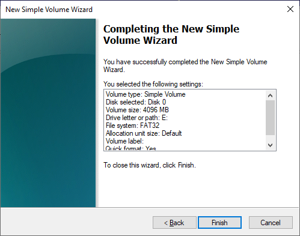
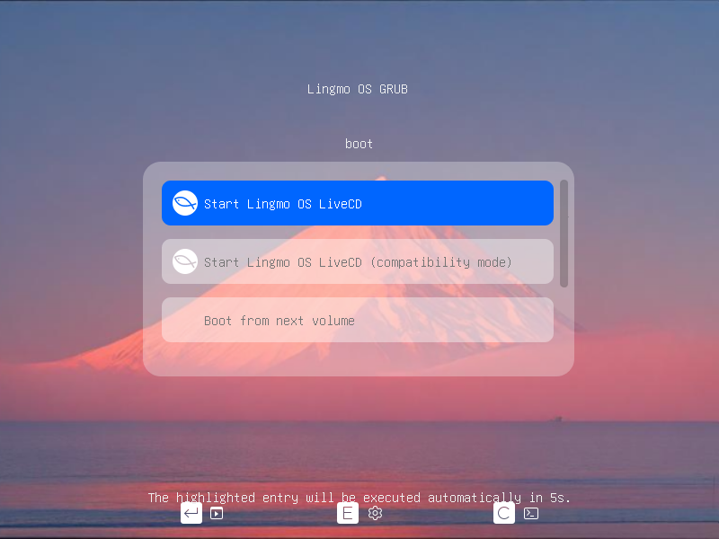
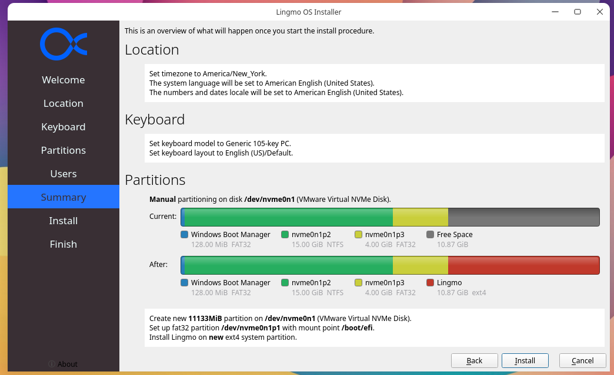

# How to Install Lingmo OS without CD or USB: A Step-by-Step Guide
This article is a guide for installing Lingmo OS without CD and USB.  
Before following any of these steps, download the ISO image from <https://lingmo.org/index.php/download-lingmo-os>.
## *1* Preparation
### *1.1* Check the boot mode
1. Press `Win+R` keys to start the Run dialog  
2. In the Run dialog type `powershell "start cmd -Verb runAs"` and press Enter to open an elevated command prompt  
3. Type `bcdedit /enum | find "winload"` and then press Enter.  
4. If it shows `winload.efi`, then the boot mode is UEFI.  
   
If it shows `winload.exe`, then the boot mode is BIOS.  
   
### *1.2* Create the disk partition
1. Press `Win+R` keys to start the Run dialog  
2. In the Run dialog type `diskmgmt.msc` and press Enter to open disk management.  
3. Right click the partition you want to shrink, and then select **Shrink Volume**.   
> Note:If the file system isn't NTFS, you can't shrink the partition.  
If there is some virtual memory on the partition, the **Shrink Volume** may still be greyed out.  

4. Enter the size you want to shrink(at least 14336MB), and then click **Shrink**.  
5. Right click the unallocated region on your hard disk, and then select **New Simple Volume**.  
6. Change the simple volume size to 4096MB, and then click **Next**.  
7. Accept the default drive letter, and then click **Next**.  
8. In the **Format Partition** dialog box, change the file system to FAT32.  
9. Review your choices, and then select **Finish**.  

## *2* Create the live environment
### *2.1* Copy the contents
Use [7-Zip](https://7-zip.org/) to open the ISO image and extract all the files and folders to the newly created partition.  
### *2.2* Install GRUB2(For UEFI)
1. Download [GRUB 2.06](https://ftp.gnu.org/gnu/grub/grub-2.06-for-windows.zip).  
> Note:GRUB 2.12 won't work properly on Windows.  

2. Extract the `grub-2.06-for-windows` folder in `grub-2.06-for-windows.zip` to the newly created partition.  
3. Open an elevated command prompt using steps in *1.1*.  
4. Use these commands to install GRUB2.  
> Replace E: with the newly created partition in the following commands.  

For UEFI:  
```cmd
cd /d E:\grub-2.06-for-windows
grub-install --target=x86_64-efi --efi-directory=E: --boot-directory=E:\boot
```
  
For BIOS:  
```cmd
cd /d E:\grub-2.06-for-windows
grub-install --target=i386-pc --boot-directory=E:\boot \\.\PHYSICALDRIVE0
```
  
## *3* Install Lingmo OS
### *3.1* Pre-installation
1. Restart the computer.  
  
2. In the Login Screen type `live` and click **Login**.  
3. Click the **Install Lingmo** shortcut icon from applications list(click the **Launcher** icon on the dock to show applications list)  
### *3.2* Installation
1. The first few pages in the installer will ask you to select language, choose your location, and select a keyboard layout.  
2. Once done first 3 steps, it goes into **Partitions**, and then choose **Manual partitioning**.  
3. Click on the free space, and click **Create** button. EXT4 filesystem is recommended.  
4. Change the mount point to **/** and click **OK**.  
5. For UEFI, click on the first partition and click **Edit**, and change the mount point to **/boot/efi**.  
6. Click **Next**.  
7. Create a user, set password and hostname(computer name).  
8. Finally, it will show a summary overview of what you did. If everything is OK, click **Install**.

9. The installation process can take a few minutes. When it is done successfully, you can restart your computer to the newly installed Lingmo OS.
