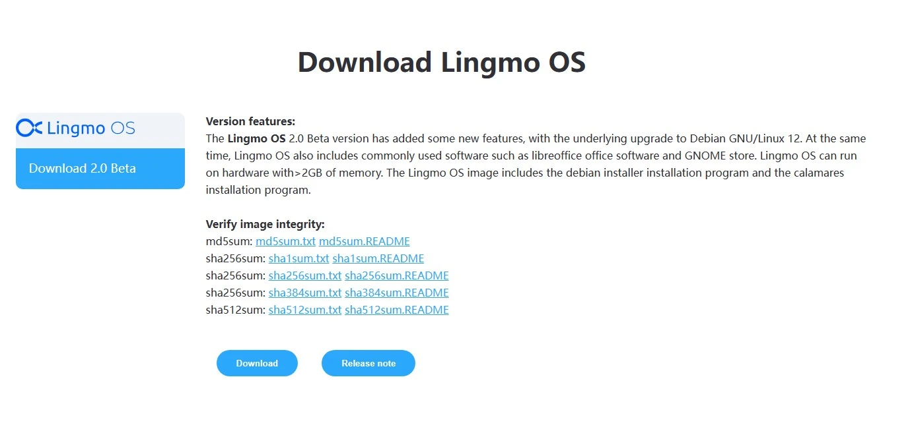
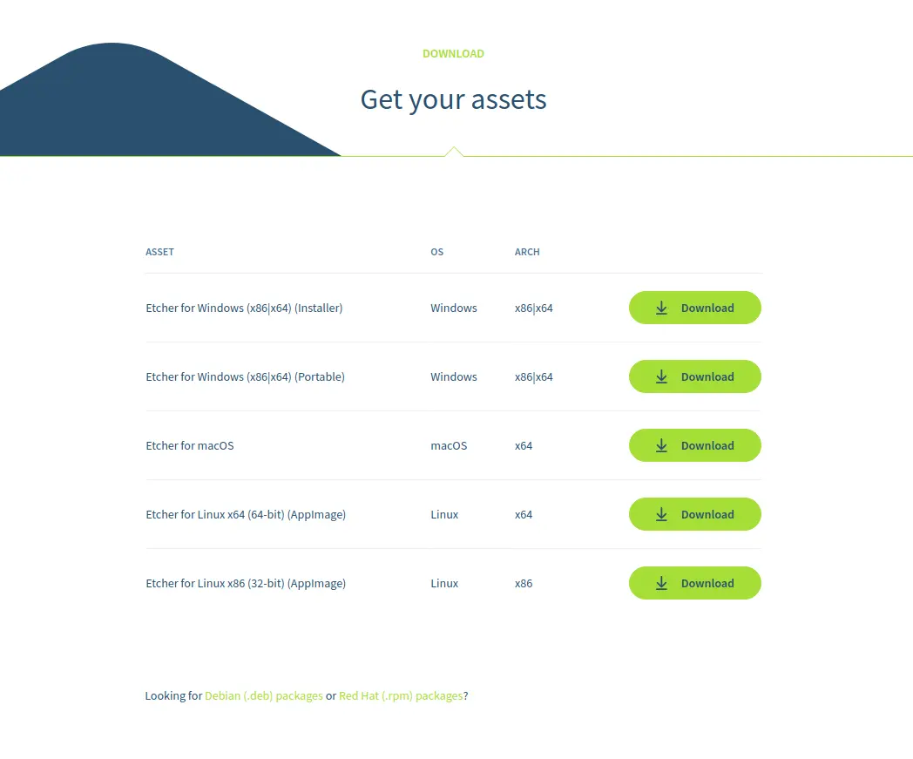
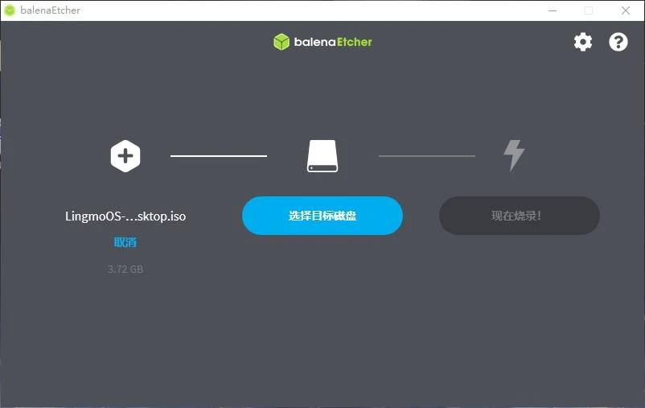
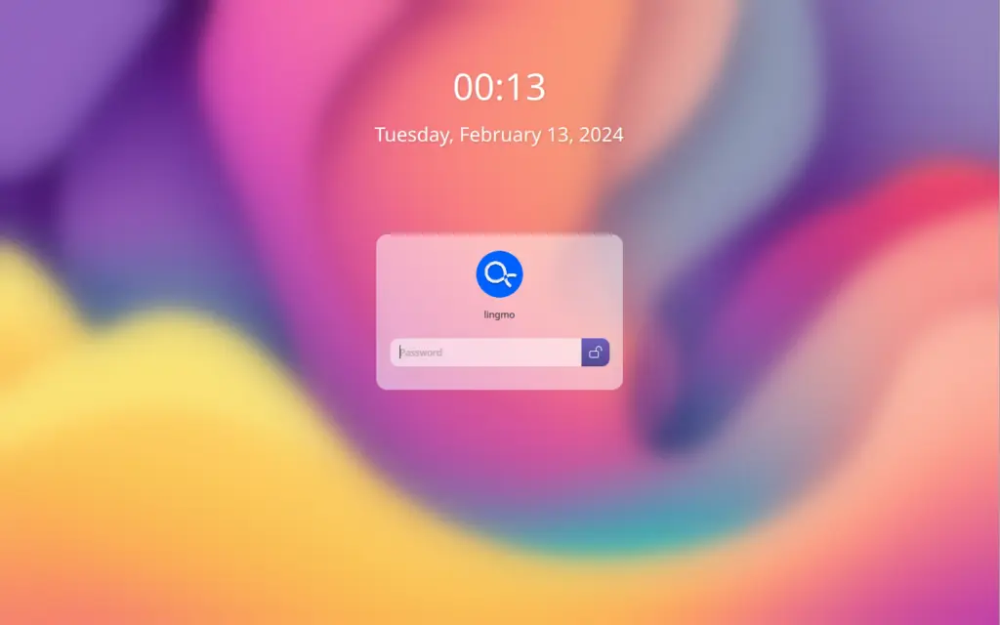
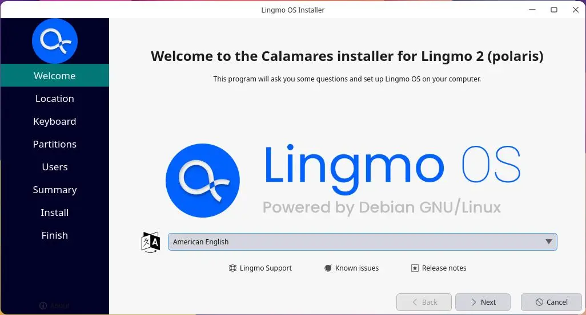
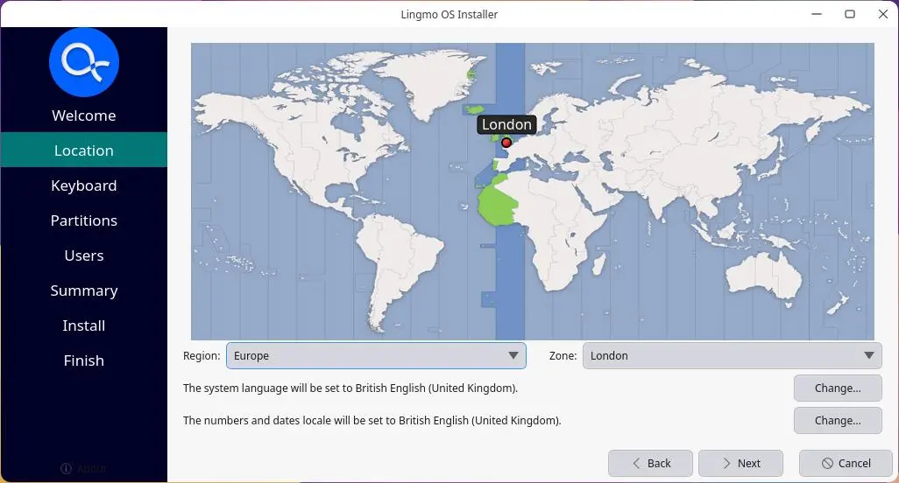
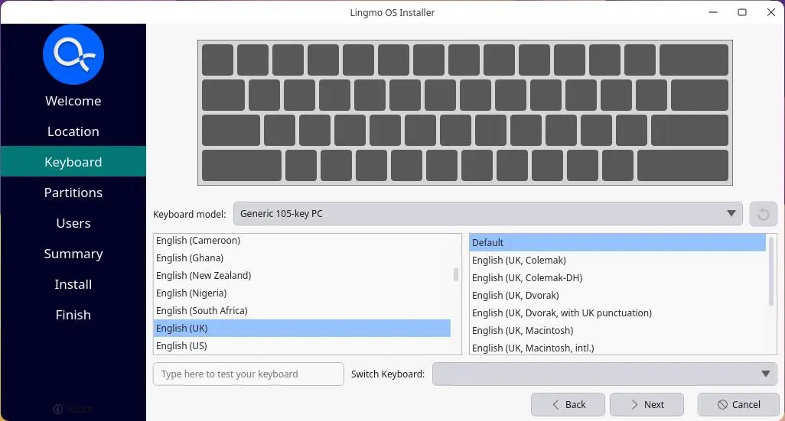
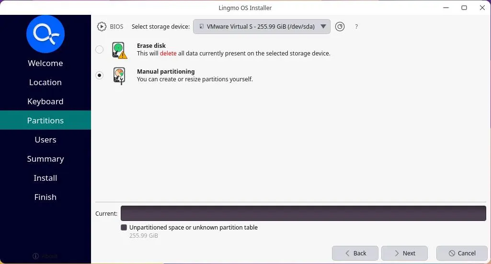
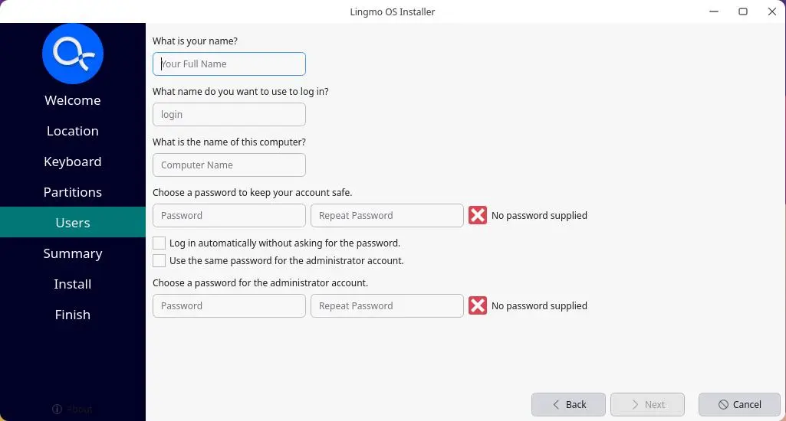

# Installation Guide

> [!Warning]
> Please be aware that Lingmo OS is in **BETA** - what this means is that Lingmo OS is under heavy development and therefore **NOT** ready for every day use.

In this tutorial, we will guide you through the steps required to install Lingmo OS on your PC. It would be advised to view the [FAQ](faq) before installing.

## *1* Preparation

- A laptop or PC with at least 10GB of storage space.

- A USB stick (4GB or above is recommended).

## *2* Download a Lingmo OS Image

You can download a Lingmo OS image [here](https://lingmo.org/download). Make sure to save it to a memorable location on your PC. For this tutorial, we will use Lingmo OS 2.1 which is the latest version.

## *3* Create a Bootable USB stick

To install Lingmo OS, you need to write your downloaded ISO to a USB stick to create the installation media.

We’ll use [Ventoy](https://ventoy.net), as it runs on Linux, Windows and macOS and it's so simple that you just need to copy the ISO image to the USB stick after installing Ventoy. Choose the version that corresponds to your current operating system, download and install the tool.

Follow this tutorial to install Ventoy to your USB stick and copy the ISO image: <https://ventoy.net/en/doc_start.html>

## *4* Boot from USB flash drive

Insert the USB flash drive into the laptop or PC you want to use to install LingmoOS and boot or restart the device. Hold `F12` (according to your motherboard manufacturer) during startup and selecting the USB device from the system-specific boot menu.

> F12 is the most common key for bringing up your system’s boot menu, but Escape, F1, F2 and F10 are common alternatives. If you’re unsure, look for a brief message when your system starts – this will often inform you of which key to press to bring up the boot menu.

On older Lingmo OS images, you will be required to enter a password to enter the live session. If you enconter this, enter the password `live` and press `Enter`.

Once logged into the live system, you can start the installer by clicking `Install Lingmo`.

Once the installer has initialised you will be invited to choose your language

> You can preview Lingmo OS without making any changes to your PC. You can return to the installer menu at any time by clicking the Install Lingmo shortcut on the desktop.

To proceed, click `Next`.

## *5* Choose your Location

Select your location and timezone from the map screen and click `Next`. This information will be detected automatically if you are connected to the internet.

## *6* Choose your Keyboard Layout

You will be asked to select your keyboard layout. Once you’ve chosen one, click `Next`.

## *7* Choose your Partitioning Layout

This screen allows you to configure your installation. If you would like Lingmo OS to be the only operating system on your hard drive, select `Erase disk` and install Lingmo OS.

> [!Warning]
> It will erase the ENTIRE DISK and you will LOST ALL THE DATA, consider using the manual partitioning described below instead.

If your device currently has another operating system installed, you will receive additional options to install Lingmo OS alongside that OS rather than replacing it.

### Manual

When using Manual to set up your system as you would like it, keep these thoughts in mind:

The root ( / ) directory needs at least 25 GBs of space.

The home ( /home ) directory needs as much space as you will need for your files, music, pictures and documents. So it is best to use the remaining space for the home partition, unless you have going to dual boot.

Swap space of at least half of the available RAM is recommended. For instance, with 8 GBs, make the swap with at least 4 GBs.

> If your computer uses UEFI boot, you might need to make a separate EFI partition with a FAT32 filesystem.

## *8* Create Your Login Details

On this screen, you will be prompted to enter your name and the name of your computer as it will appear on the network. Finally, you will create a username and a strong password.

You can choose to log in automatically or require a password. If you are using your device whilst travelling, it’s **not** recommended to keep “Log in automatically” enabled.

## *9* Confirm the Installation

You will now be asked to review the settings you have chosen. If you are happy with them, click `Install`.

And then sit back and enjoy the slideshow as Lingmo OS installs in the background! 🙂:

After reboot, you can enter your new system!

## *10* You’ve installed Lingmo OS

Thank you for completing this tutorial. We hope you enjoy your new desktop.
